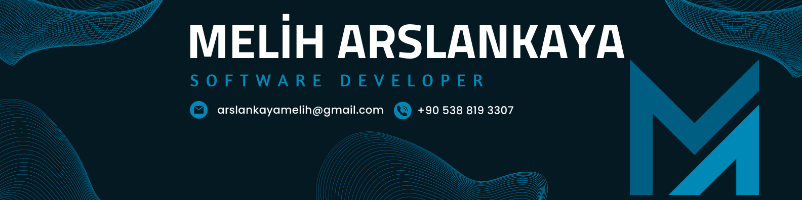

 
 

# Melih Arslankaya

### AI Engineer • Computer Vision • Data & Analytics

Building AI-powered systems focused on computer vision, OCR, forecasting, analytics, and intelligent automation.

 

---

## About

AI Engineer focused on intelligent systems, computer vision, OCR technologies, forecasting systems, analytics platforms, and scalable AI-powered applications.

Experienced in building production-focused solutions that combine machine learning, backend systems, data pipelines, and modern web technologies.

---

## Tech Stack

---

## Focus Areas

- Computer Vision  
- OCR & Image Processing  
- Forecasting Systems  
- Predictive Analytics  
- AI-Powered Automation  
- Intelligent Retail Technologies  
- Scalable AI Infrastructure 
